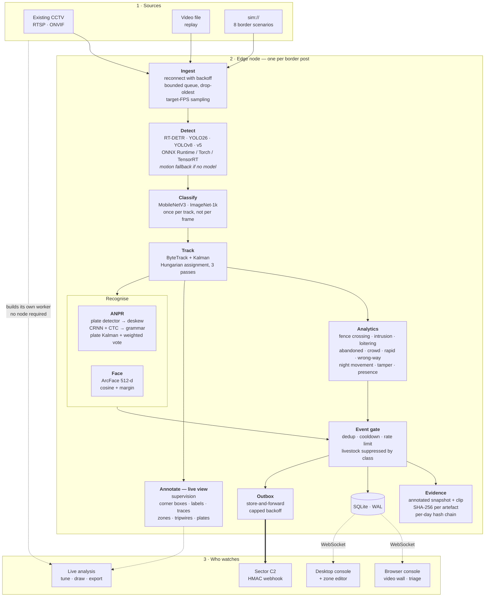
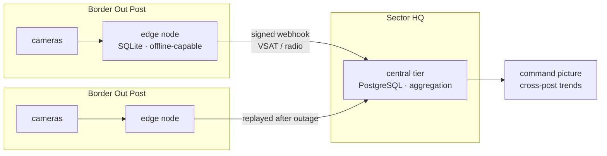
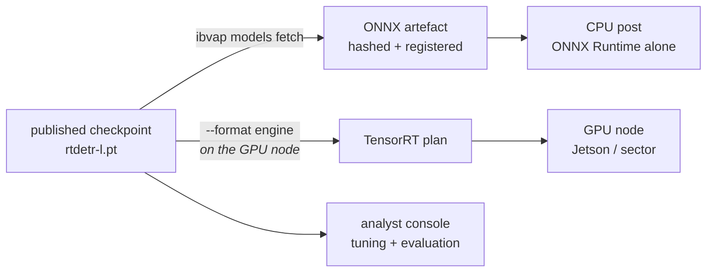

# IBVAP — Intelligent Border Video Analytics Platform

Software-defined AI surveillance that turns **existing IP CCTV** into an
intelligent sensor network — no dedicated face-recognition or ANPR appliances,
no smart cameras, no per-camera licence.

Built for Problem Statement **26187** — Ministry of Home Affairs, Sashastra
Seema Bal (SSB), Police II Division.

```bash
git clone https://github.com/tedo001/border-serv-ai && cd border-serv-ai
python app.py
```

That is the whole install. `app.py` is standard-library only, so it runs on a
bare checkout: it builds the virtual environment, installs the project, writes a
runnable configuration, generates a signing key, starts the node and opens the
console.

---

## Contents

- [What it does](#what-it-does)
- [Architecture](#architecture)
- [The pipeline, stage by stage](#the-pipeline-stage-by-stage)
- [Technology stack](#technology-stack)
- [Getting real detection](#getting-real-detection)
- [Consoles](#consoles)
- [Designed for where it runs](#designed-for-where-it-runs)
- [Repository layout](#repository-layout)
- [Command line](#command-line)
- [Development](#development)

---

## What it does

| Capability | Implementation |
|---|---|
| Human detection and tracking | RT-DETR / YOLO26 / YOLOv8 / v5 detector, ByteTrack-style tracker with a Kalman filter |
| Object classification | MobileNetV3 on ImageNet-1k, run once per track — reclassifies coarse detections, notably livestock |
| Vehicle detection and classification | Same detector, taxonomy-mapped to car / truck / bus / motorcycle / bicycle |
| Face detection and recognition | Detector → ArcFace-style 512-d embedding → watchlist gallery, matched on a margin rather than a bare threshold |
| ANPR | YOLOv8 plate detector → deskew → CRNN + CTC → **Indian number-plate grammar**, decided by a weighted vote across the vehicle's passage |
| Virtual fence intrusion | Polygon zones and directed tripwires in normalised coordinates, with hysteresis |
| Suspicious activity | Loitering, abandoned object, crowd gathering, rapid movement, wrong direction |
| Night-time movement | Schedule windows that wrap midnight, measured-darkness gating, CLAHE enhancement |
| Camera tamper | Lens obstruction, defocus and repositioning — detected while the stream is still up |
| Real-time alerting | WebSocket push, evidence with chain of custody, full audit trail |
| Live annotation | **supervision** — corner boxes, rounded labels, identity traces, zone and plate overlays |
| C2 integration | HMAC-signed webhooks with a store-and-forward outbox |

Ten rule types fire seventeen event types, all configurable per camera.

---

## Architecture

One frame's journey, from the camera to the control room:



**Why it is shaped this way.** Detection is expensive and tracking is cheap, so
the detector runs on a sampled subset of frames and the tracker fills the gaps.
Classification runs once per *track* rather than per frame, because an object's
class does not change while you watch it — and that one decision is what makes
livestock suppression affordable at the edge. Everything after the gate is
append-only: evidence is hashed as it is written, and the outbox exists because
a border post loses its uplink and the alerts raised during the outage still
matter when it comes back.

### Deployment topology



The edge tier is deliberately **not** run behind an orchestrator: a post gains
nothing from a control plane sitting on the far side of the link that just
failed.

---

## The pipeline, stage by stage

| # | Stage | What happens | Degrades to |
|---|---|---|---|
| 1 | **Ingest** | RTSP/ONVIF over TCP, reconnect with capped backoff, bounded queue that drops the *oldest* frame, per-camera FPS sampling, low-light enhancement | — |
| 2 | **Detect** | ONNX Runtime (CUDA → CPU), or a Torch checkpoint, or a TensorRT plan | MOG2 background subtraction, reported as degraded |
| 3 | **Classify** | MobileNetV3 refines the detector's coarse class, once per new track | detector classes used as-is |
| 4 | **Track** | Kalman constant-velocity filter, Hungarian assignment, three association passes including a distance pass for fast movers | — |
| 5 | **Recognise** | ANPR and face matching, run only on eligible tracks | localisation without recognition |
| 6 | **Analyse** | Ten rules over operator-drawn zones and tripwires, with confirm-frames | — |
| 7 | **Gate** | Deduplicate, cool down, rate-limit; suppress ignored classes | — |
| 8 | **Annotate** | **supervision** renders tracks, zones, tripwires and plate reads for the live view | the platform's own OpenCV renderer |
|   |  | *Evidence snapshots always use the OpenCV renderer, so the stored record never depends on an optional package* | — |
| 9 | **Record** | Annotated snapshot and clip, SHA-256 per artefact, per-day hash chain | evidence disabled by config |
| 10 | **Dispatch** | HMAC-signed webhook; persisted outbox replays in order after an outage | — |

Every fall to a lower rung is reported — in `/health`, in both consoles, in the
control panel and in the `ibvap_model_info` metric. A node that quietly ran the
weakest option would report healthy while missing people, so it never does.

---

## Technology stack

### Vision and machine learning

| Layer | Technology | Role |
|---|---|---|
| Inference runtime | **ONNX Runtime** ≥ 1.17 | What a post runs. CPU, CUDA, TensorRT, OpenVINO or DirectML from one artefact |
| Inference runtime | **Ultralytics** (PyTorch) | Development and evaluation on real checkpoints; the source ONNX is exported from |
| Inference runtime | **TensorRT** | Built on the GPU node at commissioning; fused kernels and FP16 |
| Detection | **RT-DETR**, **YOLO26**, **YOLOv8 / v11**, **YOLOv5** | Five output layouts (`rtdetr`, `yolo26`, `yolov8`, `yolov5`, `nms_xyxy`), each decoded separately, plus `auto` |
| Classification | **MobileNetV3** on ImageNet-1k | Secondary refinement, once per track |
| Tracking | **ByteTrack**-style + Kalman | Stable identities through occlusion |
| Assignment | **SciPy** `linear_sum_assignment` | Hungarian matching |
| ANPR | **YOLOv8** plate detector + **CRNN / CTC** | Localise, deskew, decode, then Indian plate grammar |
| Face | **ArcFace**-style 512-d embeddings | Cosine similarity with a margin over the runner-up |
| Annotation | **supervision** ≥ 0.25 | `sv.Detections` interchange plus the live-view annotators — corner boxes, rounded labels, identity traces |
| Imaging | **OpenCV** (headless), **NumPy** | Decode, preprocess, draw |

### Platform

| Layer | Technology |
|---|---|
| Language | **Python 3.10 – 3.12** |
| API | **FastAPI** + **Uvicorn** (uvloop, httptools) |
| Validation & config | **Pydantic v2**, **pydantic-settings**, **PyYAML** |
| Data access | **SQLAlchemy 2.0** (async), **aiosqlite**, **Alembic**, **greenlet** |
| Storage | **SQLite** in WAL mode at the edge · **PostgreSQL** (psycopg) at sector |
| Auth | **PyJWT**, **bcrypt**, four-role RBAC, scoped media tokens |
| HTTP client | **httpx** — signed webhooks, store-and-forward |
| Observability | **structlog** (JSON), **prometheus-client** |

### Consoles and delivery

| Layer | Technology |
|---|---|
| Browser console | Vanilla HTML / CSS / JavaScript — **no build step, no CDN** (a post is often air-gapped or metered) |
| Desktop consoles | **PyQt6** — operator console, live analysis console, control panel |
| Bootstrap launcher | **Tkinter** / standard library only, so it runs before anything is installed |
| Packaging | **Docker**, **systemd** |
| CI | **GitHub Actions** — ruff, mypy, pytest on 3.10/3.11/3.12, bandit, pip-audit, container smoke test |
| Testing | **pytest**, pytest-asyncio, pytest-cov — 427 tests |

---

## Getting real detection

Out of the box the platform runs on classical motion detection and says so. To
give it real weights:

```bash
pip install -e ".[torch,sv]"      # RT-DETR + the live-view annotators
ibvap analyst                     # pick rtdetr-l, press Start Analysis
```

The checkpoint downloads into `models/weights` on first use.

### The model lifecycle



```bash
ibvap models fetch rtdetr-l                          # → ONNX, ships in a site build
ibvap models fetch rtdetr-l --format engine --half   # → TensorRT, built on the node
```

A TensorRT plan is compiled for the exact GPU, driver and TensorRT version in
front of it and refuses to load on anything else, so it is a **commissioning
step on the node**, never part of the site build.

The Torch and ONNX runtimes carry the same weights and agree to within 0.006 of
score and two pixels of box on the same frame, so a threshold tuned in the
console means the same thing in the field.

Every model is declared in `models/registry.yaml` with a version, a SHA-256
checksum, its output layout and its class list. Nothing is inferred from a
filename, and a checksum mismatch refuses to load.

---

## Consoles

| Surface | Command | For | Needs a node? |
|---|---|---|---|
| **Control panel** | `python app.py` | Set up, start, stop, test, benchmark — with live node status | no |
| **Live analysis** | `ibvap analyst` | One source, tuned by hand: pick a detector, drag thresholds, draw a fence line | no |
| **Browser** | served by the node | Duty operator: video wall, alert triage, evidence review, watchlists | yes |
| **Desktop** | `ibvap console` | Supervisor: the above plus an interactive zone editor | yes |

The live analysis console is the quickest way to see the platform work. It
builds the same camera worker the node runs — same detector, tracker, rules and
event gate — so a threshold that looks right there behaves the same way on a
post. It reads an RTSP camera, a video file, or one of eight simulated border
scenarios that need no hardware at all, and exports its alert log as JSON.

**Running in PyCharm?** [`docs/PYCHARM.md`](docs/PYCHARM.md) walks from clone to
live alerts.

---

## Designed for where it runs

Remote border posts are not data centres, and the design reflects that:

- **Works without model artefacts.** Falls back to classical detection and says
  so — in `/health`, the consoles and the metrics. Never silently.
- **Survives losing the uplink.** Alerts raised during an outage are persisted
  and replayed, in order, when the link returns.
- **Drops frames, never latency.** Under load the *oldest* frame is discarded,
  so alerts stay live rather than becoming a historical record.
- **Suppresses the false alarms that matter.** Livestock on a rural fence line
  is the dominant false-alarm source. Measured on the cattle drill: the
  classical fallback alone raises a false intrusion alarm; with the classifier
  stage, 27 tracks are reclassified and no alarm fires, while a person in the
  same zone still alarms.
- **Reads a plate by agreement, not by luck.** A Kalman filter follows the plate
  through the frames the detector loses it, and the read is decided by a
  weighted vote across the whole passage — because `HR26DK8337` and
  `HR26DK8837` are not the same vehicle.
- **Evidence you can defend.** SHA-256 per artefact and a per-day hash chain, so
  both alteration and deletion are detectable months later.
- **Runs unprivileged** on commodity hardware, from a fanless mini-PC upward.
- **Privacy is a control, not a promise.** Face embeddings are stored only for
  watchlist enrolment, never for passers-by.

---

## Repository layout

```
app.py                  one-click launcher and control panel (stdlib only)
configs/                site configuration; site.example.yaml is documented
models/registry.yaml    every model, with version, checksum, layout, classes
scripts/                report generation, CI-parity test runner
deploy/                 Dockerfile, systemd units
docs/                   architecture, deployment, security, operations, PyCharm
presentation/           SIH idea-submission deck and its generator
tests/                  427 tests — unit and integration
src/ibvap/
├── core/          domain types, layered config, geometry, logging, time windows
├── ingest/        video sources, scenario simulator, resilient reader, queue
├── vision/        runtimes, detectors, classifier, tracker, ANPR, face, plates
├── analytics/     rules and the per-camera engine with its suppression gate
├── events/        annotation, evidence store, canonical payload
├── pipeline/      model bundle, camera worker, supervisor
├── storage/       ORM, async engine, repositories
├── integrations/  signed webhook sink and the store-and-forward dispatcher
├── api/           FastAPI app, auth/RBAC, routers
├── ui/            browser console — no build step, no CDN
├── desktop/       PyQt6 control panel, operator console, live analysis console
├── mlops/         registry and authoring, benchmark, evaluation, drift
└── telemetry/     Prometheus instrumentation
```

About 20,500 lines of Python across 73 modules.

---

## Command line

```bash
ibvap serve      --config configs/site.yaml   # run a node
ibvap analyst                                 # live analysis console
ibvap console    --node http://…              # desktop operator console
ibvap validate   configs/site.yaml            # check a site file before deploying it
ibvap probe      rtsp://…                     # test a camera before configuring it
ibvap benchmark  --resolution 1920x1080       # how many cameras this box can carry
ibvap models     fetch | list | verify | register
ibvap evidence   verify-chain 2026-08-24      # chain of custody
ibvap secret                                  # generate a signing key
```

<details>
<summary>Manual setup, without the launcher</summary>

```bash
python -m venv .venv && source .venv/bin/activate
pip install -e ".[dev,desktop]"

cp configs/site.example.yaml configs/site.yaml     # then edit
ibvap validate configs/site.yaml

export IBVAP_SECURITY__JWT_SECRET=$(ibvap secret | cut -d= -f2)
ibvap serve --config configs/site.yaml
```

Open <http://127.0.0.1:8080/>. The bootstrap admin password is printed once at
startup.

No cameras to hand? A synthetic source generates video in-process:

```yaml
cameras:
  - id: cam-north
    url: "synthetic://?width=640&height=480&fps=20"
    target_fps: 8
    rules:
      - { id: presence, type: presence }
```

</details>

---

## Documentation

| Document | Contents |
|---|---|
| [Architecture](docs/ARCHITECTURE.md) | How it fits together, and why each decision was made |
| [PyCharm guide](docs/PYCHARM.md) | Step-by-step, clone to live alerts |
| [Deployment](docs/DEPLOYMENT.md) | Sizing, Docker, systemd, secrets |
| [Security](docs/SECURITY.md) | Auth, RBAC, audit, privacy, evidence integrity |
| [Operations](docs/OPERATIONS.md) | Tuning, detector runtimes, ANPR commissioning, metrics, drift |

---

## Development

```bash
pytest -q                           # 427 tests, ~3 min
pytest tests/unit -q                # unit subset only
ruff check src tests
```

CI installs only the `dev` extra, so a test that quietly depends on `torch`,
`supervision` or `PyQt6` passes locally and fails there. Before pushing anything
that touches an optional dependency, run the suite the way a runner sees it:

```bash
python scripts/ci_like.py tests/unit -q
python scripts/ci_like.py tests/integration -q
```

---

## Licence

Apache-2.0.
